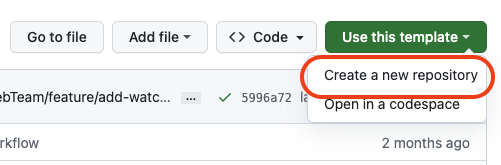
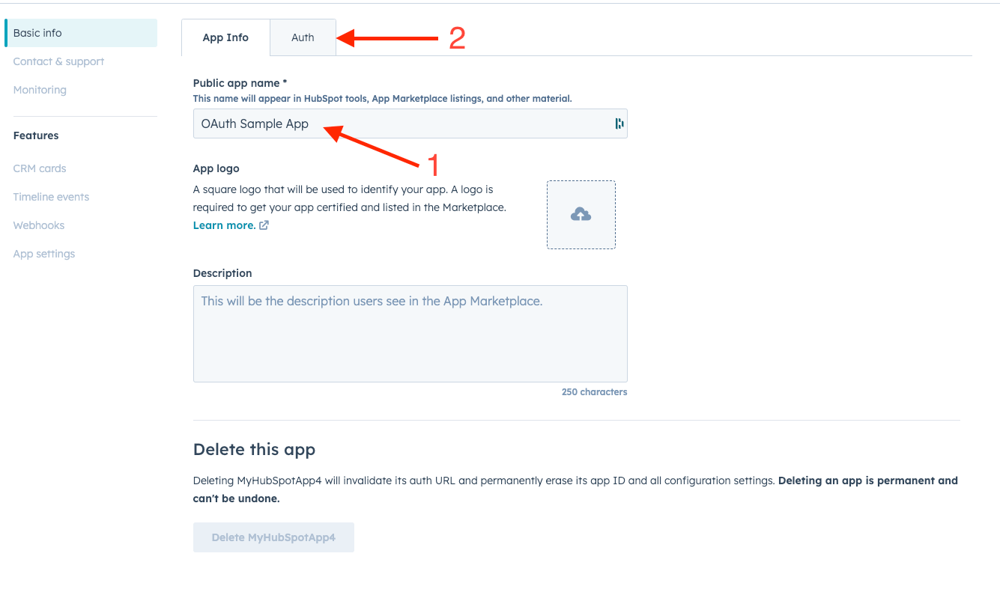
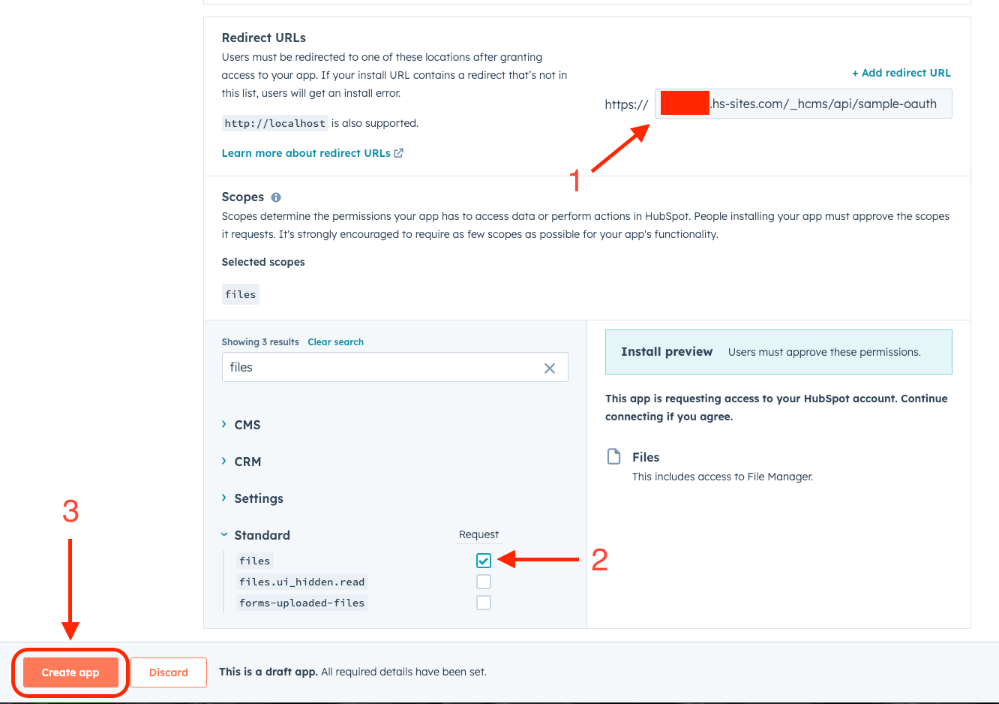
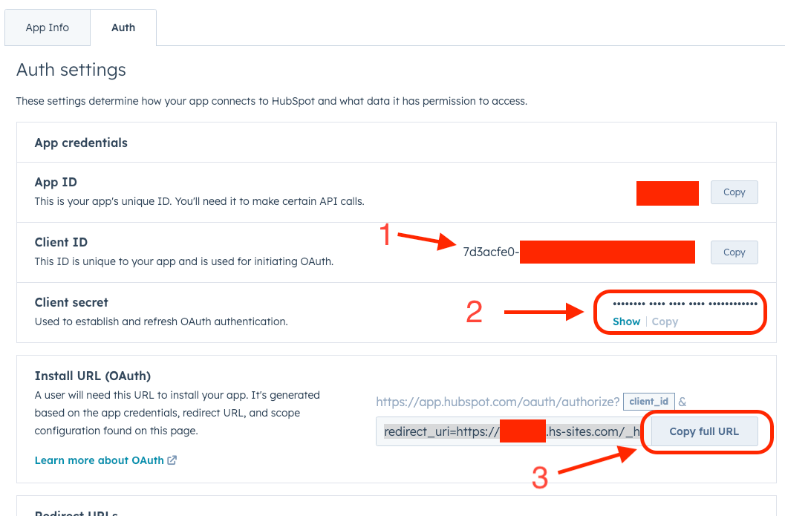
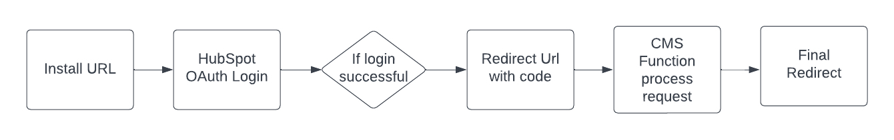
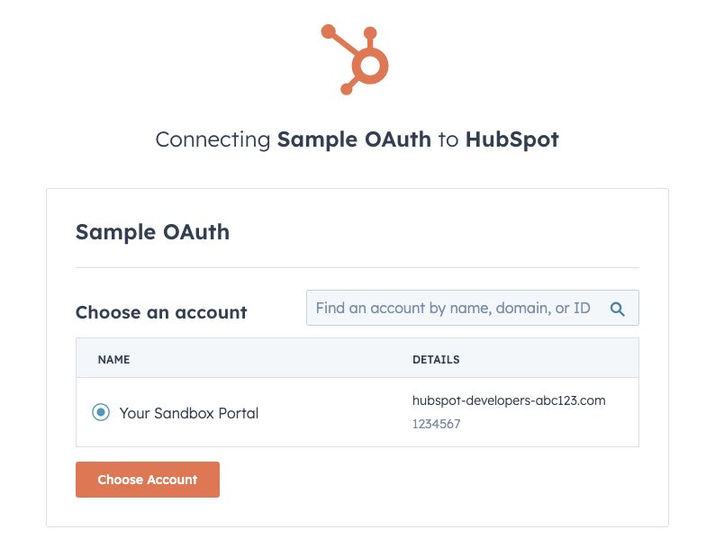
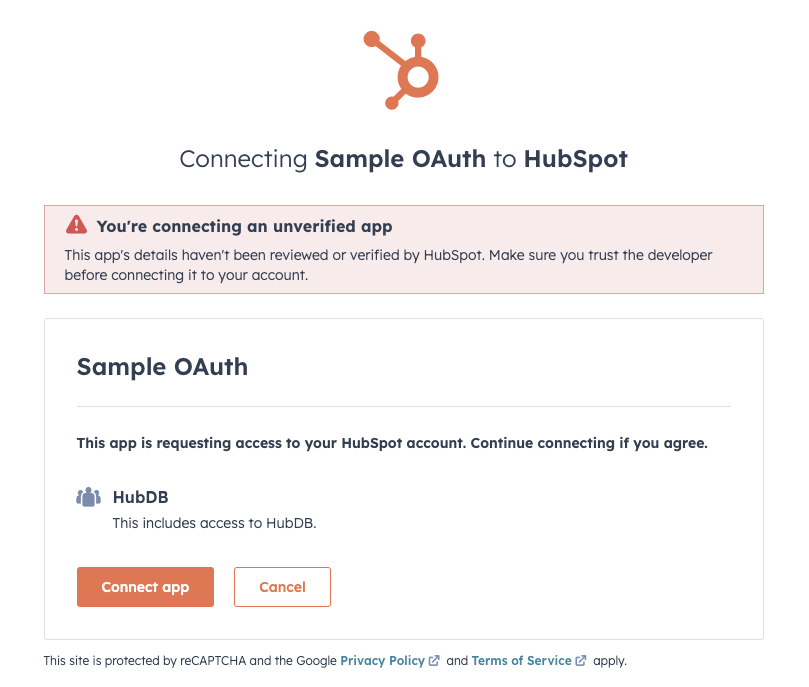
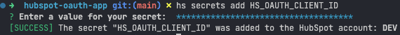
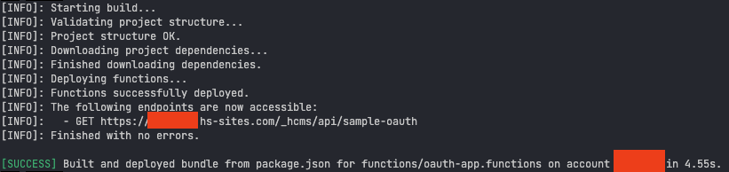

# Hubspot OAuth App Sample

This is a sample project to be used as a starting point to use the HubSpot OAuth flow for simple apps.

<!-- index-start -->
## Index

- [Requirements](#requirements)
- [Cloning this repository](#cloning-this-repository)
- [Pre-requisites](#pre-requisites)
- [Getting Started](#getting-started)
  - [What about Private Apps?](#what-about-private-apps)
- [Development](#development)
  - [Coding standards](#coding-standards)
  - [Linting Script](#linting-script)
  - [Githooks](#githooks)
- [Create an app on HubSpot](#create-an-app-on-hubspot)
- [Diagram of the OAuth Process](#diagram-of-the-oauth-process)
- [User journey](#user-journey)
- [Create the secrets](#create-the-secrets)
- [Deploy the CMS Function](#deploy-the-cms-function)
- [CMS Function context](#cms-function-context)
- [Resources](#resources)
<!-- index-end -->

## Requirements

- Node.js 18.x or above
- Install the Hubspot CLI
- A Developer Account on HubSpot, [click here to create one](https://developers.hubspot.com/get-started)

## Cloning this repository

This is a template repository, so you shouldn't clone directly this one, unless you really need to modify this very repo, but you can create a new repo using this repository as a template, just click the button `Use this template` and select the option `Create a new repository` as shown in the image below:



<!-- requirements/public-cms-start -->
## Pre-requisites

You must install the HubSpot CLI tools. We recommend installing them globally:

```sh
npm install -g @hubspot/cli
```

To use the cms-cli, you must install the HubSpot CLI client first, which you can do by running `sudo npm install -g @hubspot/cli`.
Once installed you should be able to access to the CLI using the `hs` command.

You should be familiar with the following technologies:

- [HubSpot CMS](https://developers.hubspot.com/docs/cms)
- **Git** & **Github** for branch management and version control
- [HubL](https://developers.hubspot.com/docs/cms/hubl)
- Javascript, HTML, and CSS

<!-- requirements/public-cms-end -->
<!-- setup/public-cms-getting-started-start -->
## Getting Started

Create a new repository from this template and clone it locally.

Then install the dependencies:

```sh
npm install
```

Next create HubSpot config file to link your local project to your CMS portal:

> if you don't have a HubSpot developer account, you need create one [here](https://app.hubspot.com/signup-hubspot/cms-developers) before moving on.

Run the following command in your terminal:

```sh
hs init
```

This will walk you through the steps needed to create your config file:

1. First you'll create a personal CMS access key to enable authenticated access to your account via the local development tools

2. Next, you’ll enter a name for the account. We recommend using `DEV` for your sandbox portal, but you can use any name you like.

Once completed a `hubspot.config.yml` will be created in your current directory. It will look something like this:

```yaml
defaultPortal: DEV
portals:
  - name: DEV
    portalId: 12345
    authType: personalaccesskey
    personalAccessKey: >-
      xxxxxxxxx-xxxxxxx-xxxxxxx-xxxxxxx-xxxxxxxx
    auth:
      tokenInfo:
        accessToken: >-
          xxxxxxxxx-xxxxxxx-xxxxxxx-xxxxxxx-xxxxxxxx
        expiresAt: "2023-12-12T19:38:39.164Z"
```

That's it, you can now start developing locally.

> **Note**
>
> While there is an  `expiresAt` value for the personal access key, the CMS CLI will handle reauthentication for you without further commands needed.

To authenticate to additional portals using a personal access key, run `hs auth personalaccesskey`. Those additional portals will be added to your hubspot.config.yml file.

> **Note**
>
> The `auth` node will be automatically added by the hubspot CLI once the user is authenticated via the Personal Access Key.

If you just need to obtain the Personal Access Key, you can simply click [here](https://app.hubspot.com/portal-recommend/l?slug=personal-access-key) and select the portal you want to use to authenticate.

### What about Private Apps?

At the moment of writing the package `@husbpot/cli`, which we use to deploy code to the CMS, does not support Private Apps. It will be added in the future, but for now we can only use the Personal Access Key method.

<!-- setup/public-cms-getting-started-end -->

## Development

You should always consider the repo as the source of truth, and you should never work directly on the Design Manager (DM), but apply the changes on your local machine, and then upload them to the DM with the given npm scripts.

You can either run the upload once, with:

```sh
npm run upload
```

Or you can run this instead to watch for changes:

```sh
npm run watch
```

For more info you can read the [upload command docs](https://developers.hubspot.com/docs/cms/developer-reference/local-development-cli#upload) or the [watch command docs](https://developers.hubspot.com/docs/cms/developer-reference/local-development-cli#watch).

<!-- contributing/public-code-standards-start -->
### Coding standards

We include a custom EsLint and Stylelint configurations. Please refrain from disabling or changing these rules, as they are designed to help you maintain a coding standard consistent with our own.

These rules are enforced by our CI/CD pipeline, so if you disable or change them, your project will fail to build.

We recommend installing the [ESLint](https://marketplace.visualstudio.com/items?itemName=dbaeumer.vscode-eslint) and [Stylelint](https://marketplace.visualstudio.com/items?itemName=stylelint.vscode-stylelint) extensions for VSCode to help you maintain a consistent coding style.

<!-- contributing/public-code-standards-end -->

### Linting Script

To check your linting you can run the following command:

```sh
npm run lint
```

<!-- contributing/public-githooks-start -->
### Githooks

We have included pre-commit and pre-push hooks that will run the linters and any tests before you commit or push your code. If any of these fail, you will not be able to commit or push your code.

Hooks should be set up automatically when you run `npm install`. If you have issues you may need to update your git version to support hooks. You can manually set up the hooks by running:

```sh
npm run prepare
```

<!-- contributing/public-githooks-end -->

## Create an app on HubSpot

The very first step is to create an app in your Developer Portal, go to the url `https://app.hubspot.com/developer/<PORTAL-ID>/applications` (replace the Portal ID accordingly), and click on the `Create app` button on the top right corner.

From here you will have to give a name to the App, you can add a description optionally, and then click on the `Auth` tab.



Now you need to add the `Redirect Url` (point 1), you can put any valid address for now, you can guess also the final endpoint, that it will have a similar syntax `https://<PORTAL_ID>.hs-sites.com/_hcms/api/<ENDPOINT>` by replacing the portal ID in the subdomain, and with the path of the application you can find in the `serverless.json` file, for example it could look like this `https://12345678.hs-sites.com/_hcms/api/sample-oauth`.

If you already know what scopes you will need for your application, you can go ahead and add them in the `Scopes` section (point 2), and then click on `Create app` button (point 3).



Once the app is created, you will see that some fields have been populated, you will need to get the `Client ID`, the `Client secret`, and the installation URL.



## Diagram of the OAuth Process

This is a simplified diagram of the whole OAuth Process, essentially the following steps are executed:

- User goes to the Install URL
- User logs in with his own credentials and selects a portal
- User is asked to connect with our app, showing the scopes required
- User is redirected to the Redirect URL address with the `code` added as a query parameter
- The CMS function, which is our Redirect URL, reads the `code`, and uses it alongside the `Client ID`, the `Client secret` and the `Redirect URL` to fetch the `accessToken` from HubSpot API
- Once the `accessToken` is available, you can use it to query HubSpot API with it according to the scopes selected.
- When everything is processed, the user is redirected to a final URL, a TYP (Thank You Page) or anything else.



## User journey

The user will go to the installation link, that it will guide them to the initial authentication process, where they need to login and select a portal, like the following image:



After that the user will have to link the App with their portal, confirming the permissions needed by the app, as shown below:



After the permission is granted, the user will be redirected to the Redirect URL set in the app settings, with the `code` query parameter that will be used by the CMS Function to get the actual access token.

## Create the secrets

In order to have our retrieve the `accessToken` from the HubSpot API, we need to use the `code` we received from the OAuth url, and combine it with the `Client ID`, `Client secret` and `Redirect URL`, and these variables should NEVER be stored in the code, but they must be retrieved from environmental variables, stored as Secrets in the CMS.

Once you have the values, simply run the following commands:

```shell
hs secrets add HS_OAUTH_CLIENT_ID
```

You will be ask to add the `Client ID` that you can find in the App page in your portal, and if it's successful you should see something like this:



Now rinse and repeat with the other secrets:

```shell
# Add the Client Secret
hs secrets add HS_OAUTH_CLIENT_ID

# Add the Redirect URL
hs secrets add HS_OAUTH_REDIRECT_URI
```

## Deploy the CMS Function

Once the secrets are saved in the CMS, you can add your logic in the `main` function in the `functions/oauth-app.functions/index.js` file where you see `// INSERT HERE YOUR LOGIC`.
Once the logic is in place, simply deploy the function to your portal by running the following command:

```shell
npm run deploy
```

The code above will upload the code, and deploy the CMS Function, from there you can also get the final Redirect URL, in case it's different from the one you entered at the beginning.



## CMS Function context

The function will receive a context containing some important values, the key ones that can be useful are the following:

- `params` The url query params passed to the function
- `body` The body of the requests, if the request is GET it will be an empty object
- `secrets` The secrets used by the function, also available from `process.env`
- `accountId` The account ID for the portal selected
- `method` The HTTP Method used for the endpoint
- `limits` The function limits, containing the `executionsRemaining` and `timeRemaining`

The context will be the first parameter received by the function, while the second one will be the `sendResponse` callback function, that needs to be used to return a response.

The exported function should look somethink like this:

```javascript
exports.main = async ({ params, accountId }, sendResponse) => {
  try {
    /**
     * Your logic here
     */

    sendResponse({
      statusCode: 200,
      body: {
        hello: 'world',
      },
    });
  } catch (error) {
    sendResponse({
      statusCode: 500,
      body: {
        error: error.message
      },
    });
  }

```

## Resources

- [HubSpot CLI Docs](https://developers.hubspot.com/docs/cms/developer-reference/local-development-cli)
- [HubSpot OAuth Quick Start](https://developers.hubspot.com/docs/api/oauth-quickstart-guide)